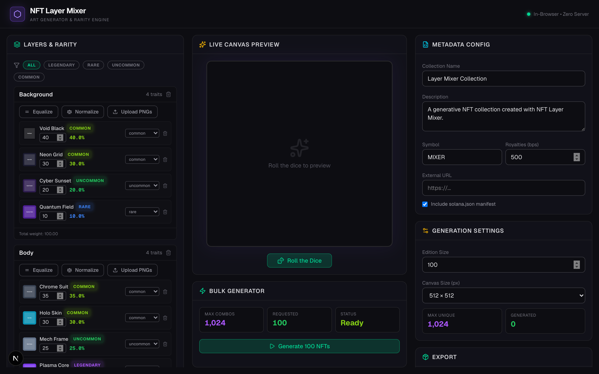
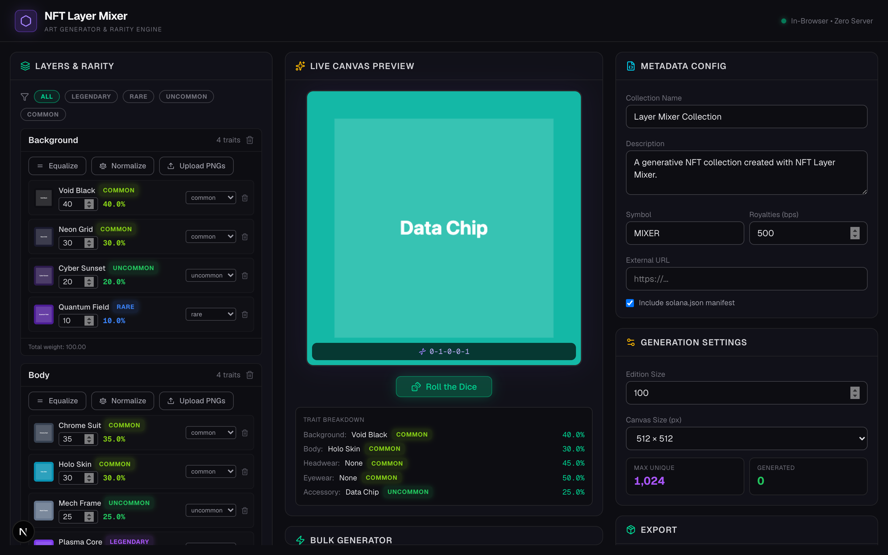

# NFT Layer Mixer — Simple User Guide

**Make NFT art collections in your browser. No install. No coding.**

**Live app:** https://nft-layer-mixer.vercel.app  
**This guide (PDF):** https://nft-layer-mixer.vercel.app/USER_MANUAL.pdf

---

## What is this?

NFT Layer Mixer stacks PNG art layers (background, body, hat, etc.) to create unique NFT images. You control how rare each trait is, preview random rolls, generate a full collection, and download a ZIP with images + metadata.

Everything runs **in your browser**. Your art never uploads to a server.



---

## The screen (3 columns)

| Left | Center | Right |
|------|--------|-------|
| Layers & traits | Preview & generate | Settings & export |
| Rarity weights | Roll the Dice | Collection name |
| Rules | Bulk generator | Download ZIP |

---

## Quick start (5 steps)

1. Open https://nft-layer-mixer.vercel.app
2. Demo layers load automatically — click **Roll the Dice** in the center
3. Click **Upload PNGs** on any layer to add your own art
4. Set **Edition Size** on the right (how many NFTs to make)
5. Click **Generate**, then **Export Collection ZIP**



---

## Step 1 — Prepare your art files

Each trait is one PNG (or JPG/WebP) image.

**Name files with a weight** so rarity is set automatically:

```text
Blue Sky#40.png       → name "Blue Sky", weight 40
Gold Crown#5.png      → name "Gold Crown", weight 5
Cyber Hoodie#25.png   → name "Cyber Hoodie", weight 25
```

Higher weight = shows up more often. No `#number` = weight **1**.

**Before you upload:**

- All layers should be the **same pixel size** (e.g. 1024×1024)
- Use **transparent backgrounds** on every layer except the bottom one
- Layers stack bottom-to-top — background first, accessories last

---

## Step 2 — Set up layers (left column)

### Add or rename layers

- Each layer = one category (Background, Body, Hat, etc.)
- Click the layer name to rename
- **Add Layer** for a new category
- Trash icon removes a layer

### Upload traits

1. Click **Upload PNGs** on a layer
2. Select your image files
3. Each file becomes one trait

### Set rarity (weights)

Every trait has a **Weight**. The app shows the **%** chance within that layer.

**Example — Background layer:**

| Trait | Weight | Chance |
|-------|--------|--------|
| Blue Sky | 40 | 40% |
| Purple Night | 30 | 30% |
| Gold Sunset | 20 | 20% |
| Rare Aurora | 10 | 10% |

### Quick buttons

- **Equalize** — same weight for every trait in that layer
- **Normalize** — scales weights to add up cleanly

### Rarity tier labels

Tags like **Common**, **Rare**, **Legendary** are for your reference. The actual odds come from **weight** numbers. Use the filter pills at the top to focus on one tier.

---

## Step 3 — Rules (optional)

Skip if you don't need special logic.

### Dependency rules — "If A, then always B"

Example: **Body / Robot** → always **Headwear / Antenna**

1. Pick Layer A + Trait A (trigger)
2. Pick Layer B + Trait B (forced result)
3. Click **Add Rule**

### Exclusion rules — "A and B never together"

Example: **Laser Visor** cannot combine with **Crown**

1. Pick both traits
2. Click **Add Rule**

---

## Step 4 — Preview & generate (center column)

### Roll the Dice

One random NFT using your weights and rules. You see the image, a **DNA** code, and every trait picked.

Roll a few times until combos look right.

### Generate collection

1. Set **Edition Size** on the right (e.g. 100)
2. Click **Generate [N] NFTs**
3. Watch the progress bar

**Max Unique** = how many different combos exist. You can't generate more unique NFTs than that.

If it fails: edition may be too big, or exclusion rules block too many combos.

---

## Step 5 — Export (right column)

### Metadata Config

| Field | What to put |
|-------|-------------|
| Collection Name | e.g. `My Cool Apes` → `My Cool Apes #1`, `#2`… |
| Description | Short blurb about the project |
| Symbol | Short ticker, e.g. `MCA` |
| Royalties (bps) | 500 = 5%. Use 0 for none. |
| External URL | Your website |
| solana.json | Check if minting on Solana |

### Generation Settings

| Field | What to put |
|-------|-------------|
| Edition Size | How many NFTs |
| Canvas Size | 512, 1024, or 2048 px output |

### Export Collection ZIP

After generation, click **Export Collection ZIP**. You get:

```text
images/           ← 0.png, 1.png, 2.png …
metadata/         ← 0.json, 1.json … (one per NFT)
metadata.json     ← master list
rarity-report.json← trait distribution stats
solana.json       ← optional, for Solana mints
```

Each JSON has name, traits, DNA, edition — ready for most mint tools.

---

## FAQ

**Install anything?** No — just open the link in a browser.

**Is my art uploaded?** No. Stays on your computer until you export the ZIP.

**Start over?** Refresh the page, or delete layers with the trash icon.

**Best format?** PNG with transparency.

**How many unique NFTs?** Multiply trait counts per layer. The app shows **Max Unique** on the right.

**Layers misaligned?** Make every PNG the same size and aligned in your art tool.

---

## Checklist before minting

- [ ] Every layer has traits
- [ ] Weights look right (check % per layer)
- [ ] Rolled dice — combos look good
- [ ] Rules work (if using any)
- [ ] Edition size ≤ Max Unique
- [ ] Name + description filled in
- [ ] Full generation finished without errors
- [ ] Exported ZIP — spot-checked images + JSON

---

## Links

- **App:** https://nft-layer-mixer.vercel.app
- **PDF guide:** https://nft-layer-mixer.vercel.app/USER_MANUAL.pdf

No account required. Everything runs in your browser.
