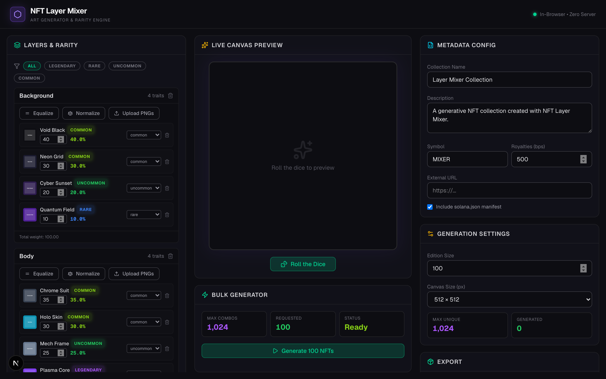
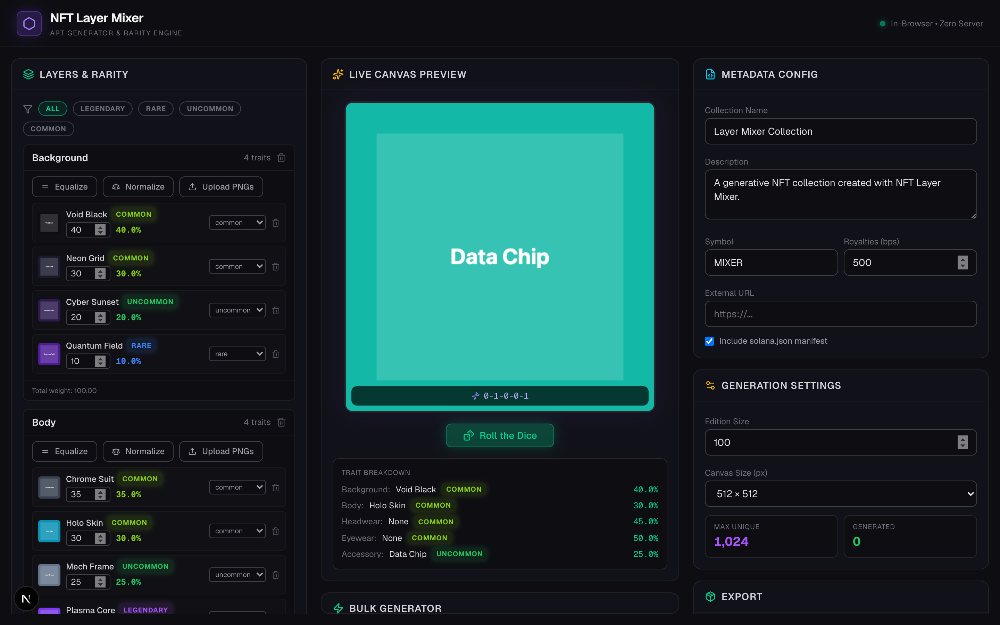

# NFT Layer Mixer — Simple User Guide

**Make NFT art collections in your browser. No install. No coding.**

**Live app:** https://nft-layer-mixer.vercel.app  
**This guide (PDF):** https://nft-layer-mixer.vercel.app/USER_MANUAL.pdf

---

## What is this?

NFT Layer Mixer stacks PNG art layers (background, body, hat, etc.) to create unique NFT images. You control how rare each trait is, preview random rolls, generate a full collection, and download a ZIP with images + metadata.

Everything runs **in your browser**. Your art never uploads to a server.



---

## The screen (3 columns)

| Left | Center | Right |
|------|--------|-------|
| Layers & traits | Preview & generate | Settings & export |
| Rarity weights | Roll the Dice | Collection name |
| Rules | Bulk generator + batch runs | Download ZIP / Progress |

---

## Quick start (5 steps)

1. Open https://nft-layer-mixer.vercel.app
2. Demo layers load automatically — click **Roll the Dice** in the center
3. Click **Upload PNGs** on any layer to add your own art
4. Set **Edition Size** on the right (how many NFTs to make)
5. Click **Generate**, then **Export Collection ZIP**

**Making thousands of NFTs?** Skip step 4–5’s one-shot Generate. Use **Batch Collection Run** in the center panel instead (see below).



---

## Step 1 — Prepare your art files

Each trait is one PNG (or JPG/WebP) image.

**Name files with a weight** so rarity is set automatically:

```text
Blue Sky#40.png       → name "Blue Sky", weight 40
Gold Crown#5.png      → name "Gold Crown", weight 5
Cyber Hoodie#25.png   → name "Cyber Hoodie", weight 25
```

Higher weight = shows up more often. No `#number` = weight **1**.

**Before you upload:**

- All layers should be the **same pixel size** (e.g. 1024×1024)
- Use **transparent backgrounds** on every layer except the bottom one
- Layers stack bottom-to-top — background first, accessories last

---

## Step 2 — Set up layers (left column)

### Add or rename layers

- Each layer = one category (Background, Body, Hat, etc.)
- Click the layer name to rename
- **Add Layer** for a new category
- Trash icon removes a layer

### Upload traits

1. Click **Upload PNGs** on a layer
2. Select your image files
3. Each file becomes one trait

### Set rarity (weights)

Every trait has a **Weight**. The app shows the **%** chance within that layer.

**Example — Background layer:**

| Trait | Weight | Chance |
|-------|--------|--------|
| Blue Sky | 40 | 40% |
| Purple Night | 30 | 30% |
| Gold Sunset | 20 | 20% |
| Rare Aurora | 10 | 10% |

### Quick buttons

- **Equalize** — same weight for every trait in that layer
- **Normalize** — scales weights to add up cleanly

### Rarity tier labels

Tags like **Common**, **Rare**, **Legendary** are for your reference. The actual odds come from **weight** numbers. Use the filter pills at the top to focus on one tier.

---

## Step 3 — Rules (optional)

Skip if you don't need special logic.

### Dependency rules — "If A, then always B"

Example: **Body / Robot** → always **Headwear / Antenna**

1. Pick Layer A + Trait A (trigger)
2. Pick Layer B + Trait B (forced result)
3. Click **Add Rule**

### Exclusion rules — "A and B never together"

Example: **Laser Visor** cannot combine with **Crown**

1. Pick both traits
2. Click **Add Rule**

---

## Step 4 — Preview & generate (center column)

### Roll the Dice

One random NFT using your weights and rules. You see the image, a **DNA** code, and every trait picked.

Roll a few times until combos look right.

### Generate collection (small / one-off)

For smaller collections that fit comfortably in one browser run (often a few hundred, depending on canvas size):

1. Set **Edition Size** on the right (e.g. 100)
2. Click **Generate [N] NFTs**
3. Watch the progress bar
4. Click **Export Collection ZIP** on the right

**Max Unique** = how many different combos exist. You can't generate more unique NFTs than that.

If it fails: edition may be too big, or exclusion rules block too many combos.

### Batch Collection Run (large collections)

Use this when you want thousands of NFTs (for example ~7,676) without crashing the browser. The app generates **batches** (default **1,000** at a time), keeps every used DNA so later batches never duplicate earlier ones, and continues edition numbers across batches (`#1–#1000`, then `#1001–#2000`, and so on).

**Important:** Browser storage can be cleared. After every batch, keep the downloaded **`collection-progress.json`** file — that is your recovery source if you refresh, change computers, or lose the session.

#### Start a run

1. Finish layers, weights, rules, canvas size, and metadata first  
   (do **not** change layers/rules/canvas mid-run)
2. In the center panel, find **Batch Collection Run**
3. Set **Total target** (e.g. `7676`) and **Batch size** (default `1000`)
4. Click **Start Run** — batch 1 generates immediately

#### After each batch

1. Progress shows **Completed / Target**, current **Batch**, and **Next range**
2. A **`…-progress-batch1.json`** (then `batch2`, `batch3`…) file downloads automatically — save it somewhere safe
3. Click **Export Collection ZIP** on the right for that batch’s images + metadata  
   (named like `my-cool-apes-batch1-1-1000.zip`; the ZIP also includes `collection-progress.json`)
4. Click **Generate Next [N]** for the following batch
5. Repeat until **Completed** equals your total target

Only the **current batch’s images** stay in memory. Earlier image blobs are released after you move on — DNA history is what persists.

#### Resume later or on another computer

1. Open the same project (same layers, rules, and canvas size)
2. Top bar → **Import Progress** → choose your saved `collection-progress.json`
3. Click **Generate Next [N]** to continue from the next edition range

You can also click **Progress** anytime to re-download the current progress file.

#### Reset a run

Click **Reset Run** if you want to start over. This clears DNA history for that run. Keep your old progress file if you might need it again.

#### If the next batch is blocked

You changed layers, ban/dependency rules, or canvas size after the run started. Restore the original project settings, or reset the run and start fresh.

---

## Step 5 — Export (right column)

### Metadata Config

| Field | What to put |
|-------|-------------|
| Collection Name | e.g. `My Cool Apes` → `My Cool Apes #1`, `#2`… |
| Description | Short blurb about the project |
| Symbol | Short ticker, e.g. `MCA` |
| Royalties (bps) | 500 = 5%. Use 0 for none. |
| External URL | Your website |
| solana.json | Check if minting on Solana |

### Generation Settings

| Field | What to put |
|-------|-------------|
| Edition Size | How many NFTs |
| Canvas Size | 512, 1024, or 2048 px output |

### Export Collection ZIP

After generation (or after each batch), click **Export Collection ZIP**. You get:

```text
images/                  ← PNGs for this batch (global edition numbering)
metadata/                ← one JSON per NFT
metadata.json            ← master list for this export
rarity-report.json       ← trait distribution stats
solana.json              ← optional, for Solana mints
collection-progress.json ← only for batch runs (DNA history + next edition)
```

**Batch run ZIP names** (easy to sort):

```text
my-cool-apes-batch1-1-1000.zip
my-cool-apes-batch2-1001-2000.zip
my-cool-apes-batch3-2001-3000.zip
```

One-off Generate ZIPs still use an edition range + timestamp (no `batchN`).

Each JSON has name, traits, DNA, edition — ready for most mint tools.

### Progress file (batch runs)

Top bar buttons:

| Button | What it does |
|--------|----------------|
| **Progress** | Download the current progress file (`…-progress-batchN.json`) |
| **Import Progress** | Resume a run from a saved progress file |

Progress filenames match the batch number, e.g. `my-cool-apes-progress-batch1.json`, then `…-batch2.json`.

The progress file has **no images** — only DNA history, edition counters, and a fingerprint of your layers/rules/canvas. Keep every batch ZIP **and** the latest progress file.

---

## FAQ

**Install anything?** No — just open the link in a browser.

**Is my art uploaded?** No. Stays on your computer until you export the ZIP.

**Start over?** Refresh the page, or delete layers with the trash icon. For a batch run, use **Reset Run**.

**Best format?** PNG with transparency.

**How many unique NFTs?** Multiply trait counts per layer. The app shows **Max Unique** on the right.

**Layers misaligned?** Make every PNG the same size and aligned in your art tool.

**Huge collection (thousands)?** Use **Batch Collection Run** (default 1,000 per batch). Don’t try one giant Generate — browsers often run out of memory, especially at 2048px.

**Lost my batch progress?** Import your saved `collection-progress.json`. If you don’t have that file, you’ll need to start a new run.

**Can I change traits mid-run?** No. Keep layers, rules, and canvas size the same until the run finishes (or reset and start over).

---

## Checklist before minting

- [ ] Every layer has traits
- [ ] Weights look right (check % per layer)
- [ ] Rolled dice — combos look good
- [ ] Rules work (if using any)
- [ ] Total editions ≤ Max Unique
- [ ] Name + description filled in
- [ ] Generation finished without errors
- [ ] For large collections: all batch ZIPs exported and saved
- [ ] For large collections: latest `collection-progress.json` saved
- [ ] Spot-checked images + JSON (edition numbers continuous across batches)

---

## Links

- **App:** https://nft-layer-mixer.vercel.app
- **PDF guide:** https://nft-layer-mixer.vercel.app/USER_MANUAL.pdf

No account required. Everything runs in your browser.
